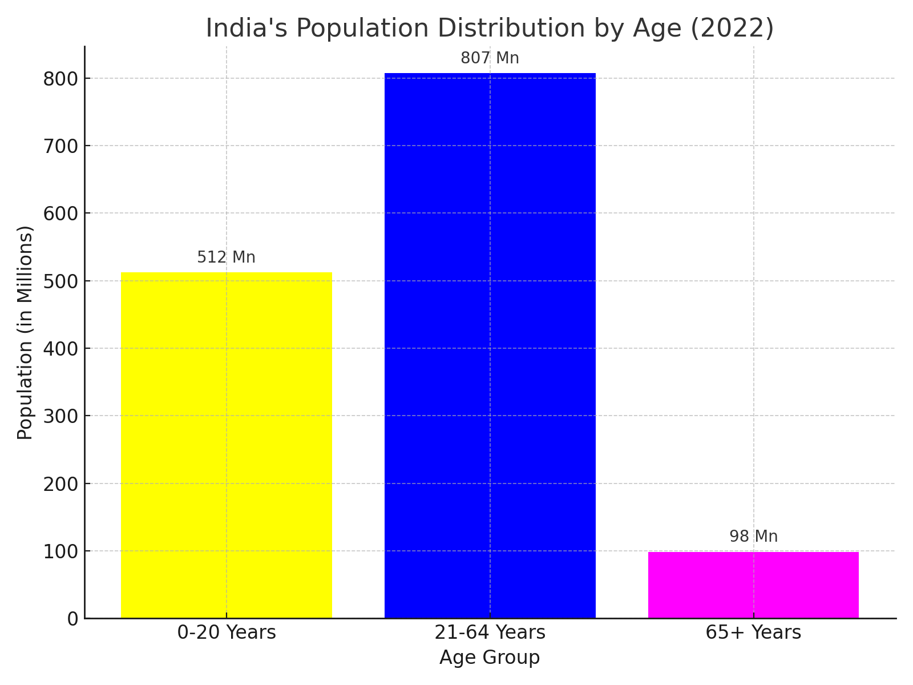

# Population Distribution Visualization

This project is part of Task 01 of my Data Science Internship at SkillCraft Technology.

## 📊 Task Objective
Visualize the distribution of India's population by age in 2022 using a bar chart.

## 📁 Files Included
- `population_chart.py`: Python script to generate the bar chart
- `population_chart.png`: Output image of the chart

## 📈 Chart Info
The chart shows:
- 0-20 Years: 512 Mn (36.1%)
- 21-64 Years: 807 Mn (57.0%)
- 65+ Years: 98 Mn (6.9%)

## 🔧 Tools Used
- Python
- Matplotlib

## ✅ Output

